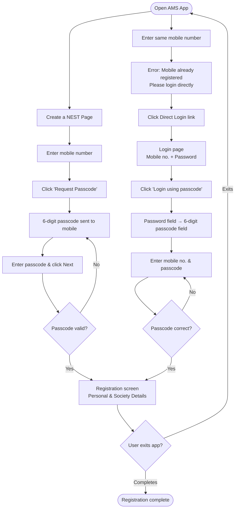

## User Registration - Alternate Flow Diagram 
---

```mermaid
flowchart TD
    A([Open AMS App])

    A --> B[Create a NEST Page]
    A --> J[Enter same mobile number]

    B --> C[Enter mobile number]
    C --> D[Click 'Request Passcode']
    D --> E[6-digit passcode sent to mobile]
    E --> F[Enter passcode & click Next]
    F --> G{Passcode valid?}
    G -- No --> E
    G -- Yes --> R

    J --> K[Error: Mobile already registered\nPlease login directly]
    K --> L[Click Direct Login link]
    L --> M[Login page\nMobile no. + Password]
    M --> N[Click 'Login using passcode']
    N --> O[Password field → 6-digit passcode field]
    O --> P[Enter mobile no. & passcode]
    P --> Q{Passcode correct?}
    Q -- No --> P
    Q -- Yes --> R

    R[Registration screen\nPersonal & Society Details]
    R --> S{User exits app?}
    S -- Completes --> T([Registration complete])
    S -- Exits --> A
```
